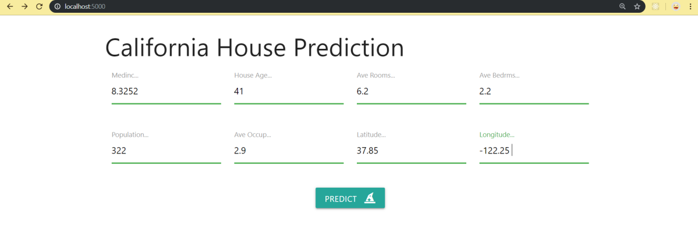
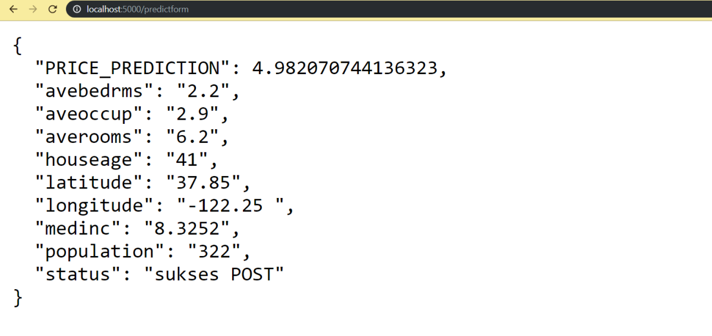

# California House Pricing 🏠

## A Flask app & ML Sklearn to predict California house pricing.

1. Download/clone this repo, open and simply run it:

    ```bash
    $ git clone https://github.com/thirupathi-chintu/Linear_regression_ML.git
    
    $ cd Linear_regression_ML

    $ py app.py
    ```

2. It will automatically run on __http://localhost:5000/__. Open it via your favourite browser then you will see its landing page:

    

    Try to POST to __http://localhost:5000/predict__

    ```bash
    POST    /predict
    
    JSON Body request: 
        {
            "medinc" : [number],
            "houseage" : [number],
            "averooms" : [number],
            "avebedrms" : [number],
            "population" : [number],
            "aveoccup" : [number],
            "latitude" : [number],
            "longitude" : [number],
        }
    ```

3. Back to __http://localhost:5000/__ then you will be redirected to its prediction page form, where you can try to predict a profile. Insert __medinc__, __houseage__, __averooms__, __avebedrms__, __population__, __aveoccup__, __latitude__ & __longitude__ then click __Predict__ button. The result will be shown on __http://localhost:5000/predictform__:

    

4. __Done!__ 👍 Enjoy your code 😎

#

#### Lintang Wisesa :love_letter: _lintangwisesa@ymail.com_

[Facebook](https://www.facebook.com/lintangbagus) | 
[Twitter](https://twitter.com/Lintang_Wisesa) |
[Google+](https://plus.google.com/u/0/+LintangWisesa1) |
[Youtube](https://www.youtube.com/user/lintangbagus) | 
:octocat: [GitHub](https://github.com/LintangWisesa) |
[Hackster](https://www.hackster.io/lintangwisesa)